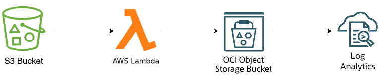
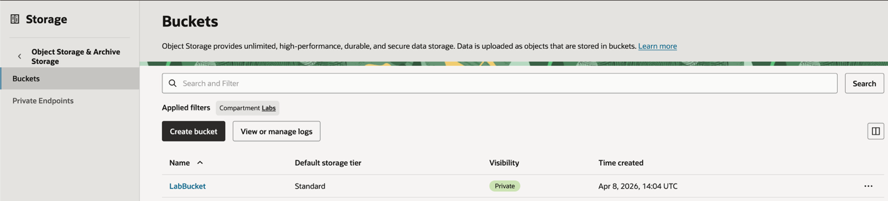
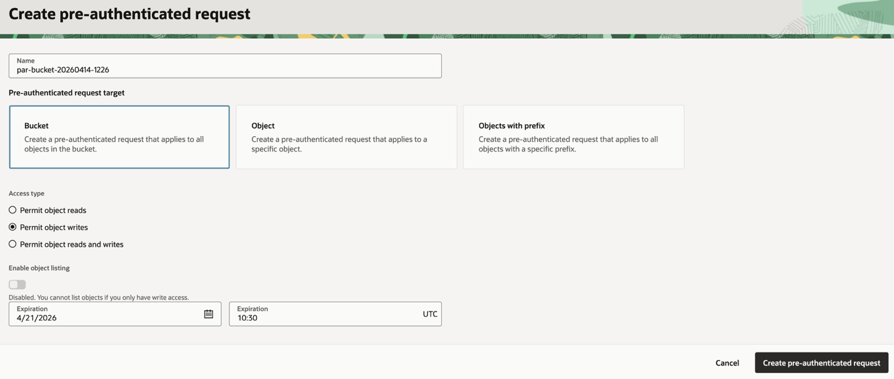
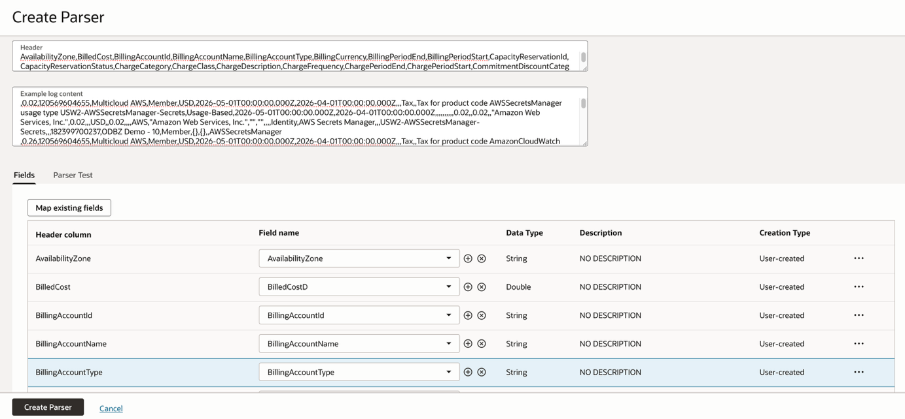
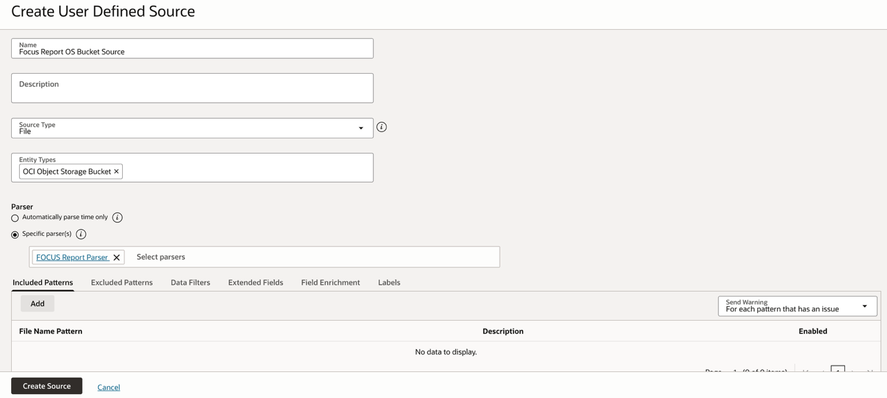
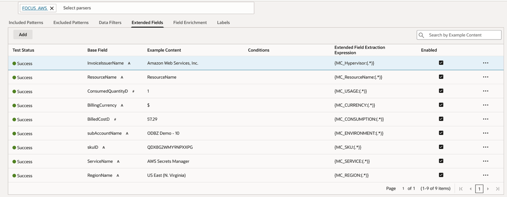
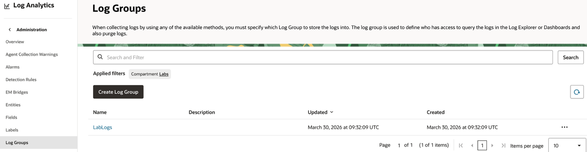
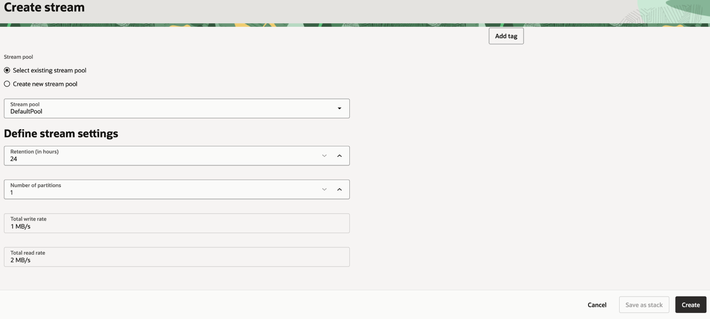
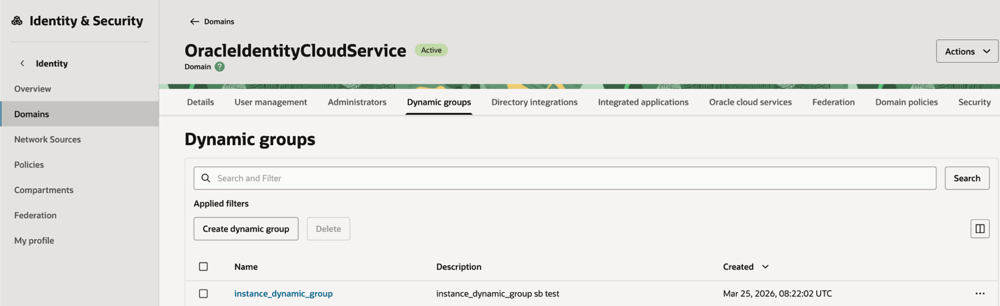

# OCI Log Analytics for AWS FinOps Analysis

Organizations adopting multicloud strategies need more than consolidated visibility. They need strong **FinOps capabilities** to understand, govern, and optimize cost and usage data consistently across cloud providers. **FOCUS reports** help address this challenge by offering a standardized billing and usage format that can be centralized and analyzed across environments. When ingested into **OCI Log Analytics**, these reports enable teams to explore spending patterns, filter and correlate usage data, identify anomalies, and build the operational visibility needed to support more effective cost management and financial accountability in multicloud environments.

This post walks through the steps required to continuously collect FOCUS reports from an AWS S3 bucket, transfer them to an OCI Object Storage bucket using a Lambda function, and then ingest them into OCI Log Analytics.



## 1. Prepare the FOCUS reports landing zone in OCI Object Storage

The first step is to define the OCI Object Storage bucket that will receive your FOCUS report files. In many environments, this bucket becomes the common landing zone for billing exports, transformed cost data, or scheduled report drops from external tools.

For this pattern, the bucket should be easy to identify, owned by the target OCI compartment, and configured so that new object uploads can be detected.

Under **Object Storage & Archive Storage**, select **Buckets**, then click **Create bucket** to create a new bucket.



OCI Log Analytics object collection supports data stored directly in Object Storage and can collect objects in three modes:

- **LIVE** for continuous collection of new files
- **HISTORIC** for one-time collection over a time range
- **HISTORIC_LIVE** for backfilling existing files and then continuing with new uploads

If your goal is ongoing FOCUS report ingestion, **LIVE** is the natural choice. If you already have historical FOCUS files in the bucket and want both backfill and continuous collection, use **HISTORIC_LIVE** instead.

The next step is to authorize ingestion of the FOCUS reports from the other cloud provider into your OCI Object Storage bucket by using a **Pre-Authenticated Request (PAR)**.

Select the bucket you created earlier, then navigate to **Management**. Under **Pre-authenticated requests**, click **Create Pre-authenticated Request**.

For **Access Type**, select **Permit object writes**, then choose the desired expiration date.

The PAR URL is shown only once and acts as a temporary upload endpoint. After the PAR is created, copy the generated URL and store it somewhere safe.



## 2. Transferring AWS FOCUS exports from S3 to OCI OS Bucket

For AWS, the source data should first be produced as a FOCUS export and delivered to an **S3 bucket**. In AWS navigate to **Billing and Cost Management**, open **Data Exports**, create a standard export, select **FOCUS with AWS columns**, choose **FOCUS 1.2**, and set Time granularity to Daily. Then select the required columns, choose the destination S3 bucket and prefix, confirm the output format such as **CSV**, and create the export.

AWS may take up to 24 hours before a new export starts delivering files. After the first delivery, validate the source prefix with:

```bash
aws s3 ls s3://<SOURCE_BUCKET>/<SOURCE_PREFIX>/ --recursive
```

### Preparing AWS Lambda access

The S3-to-OCI transfer can be automated with an **AWS Lambda function**. The Lambda execution role needs basic S3 read permissions.

Add the following inline policy to the Lambda execution role.

For this implementation:

- Bucket: aws-oci-focus1.2
- Prefix: AWSfocus12/AWSfocusDataexport/data/

```json
{
  "Version": "2012-10-17",
  "Statement": [
    {
      "Sid": "ListSourcePrefix",
      "Effect": "Allow",
      "Action": "s3:ListBucket",
      "Resource": "arn:aws:s3:::aws-oci-focus1.2",
      "Condition": {
        "StringLike": {
          "s3:prefix": [
            "AWSfocus12/AWSfocusDataexport/data/",
            "AWSfocus12/AWSfocusDataexport/data/*"
          ]
        }
      }
    },
    {
      "Sid": "ReadSourceObjects",
      "Effect": "Allow",
      "Action": "s3:GetObject",
      "Resource": "arn:aws:s3:::aws-oci-focus1.2/AWSfocus12/AWSfocusDataexport/data/*"
    }
  ]
}
```

### Configuring the transfer to OCI Object Storage

Open the **AWS Console** and navigate to the **Lambda** service. From the Lambda page, select **Functions**, then choose **Create function** to start configuring a new Lambda function.

In the creation wizard, select **Author from scratch**. Enter the function name as **s3-to-oci-transfer**, then choose **Python 3.x** as the runtime. For the architecture, select **x86_64**, unless your team standards require the use of **arm64**.

In the **Permissions** section, either create a new execution role with basic Lambda permissions or select an existing approved role, depending on your organization’s security and governance requirements.

After reviewing the configuration, select **Create function** to create the Lambda function.

### Add S3 permissions to the Lambda role

Open the **Lambda function** you created and go to the **Configuration** tab. From there, select **Permissions** and open the **execution role** by selecting its role name.

This will take you to **IAM**. In the IAM role page, choose **Add permissions**, then select **Create inline policy**. Open the **JSON** tab and paste the policy defined earlier.

Save the policy with a clear name, such as **s3-read-aws-focus-data**, so it is easy to identify later as the policy that allows the Lambda function to read the AWS FOCUS data from S3.

### Add environment variables

Next, configure the environment variables required by the Lambda function. In the Lambda function page, go to:

**Configuration → Environment variables → Edit**

Add the following variables:

```text
SOURCE_BUCKET = aws-oci-focus1.2
SOURCE_PREFIX = AWSfocus12/AWSfocusDataexport/data/
DEST_PREFIX = data
OCI_KEY_MODE = flat_unique
OCI_BASE_URL = https://objectstorage.eu-frankfurt-1.oraclecloud.com/p/<PAR_TOKEN>/n/frxfz3gch4zb/b/LabBucket/o
```

These values define the source S3 bucket and prefix, the destination prefix in OCI Object Storage, the object naming mode, and the OCI Object Storage PAR base URL used by the function to upload the files.

### Paste and deploy the code

After the permissions and environment variables are configured, open the Code tab of the Lambda function. Open the file lambda_function.py and replace the starter code with the following Lambda code:

[lambda_function.py](https://github.com/simonebucci/aws-focusreport-to-oci-loganalytics/blob/main/lambda_function.py)

Once the code has been pasted, select Deploy to save and publish the changes. Also verify that the configured handler is:

```text
lambda_function.lambda_handler
```

This ensures that AWS Lambda invokes the correct Python function when the Lambda runs.

### Configure timeout, memory, and temporary storage

Finally, adjust the runtime configuration for the expected file transfer workload. In the Lambda function page, go to:

Configuration → General configuration → Edit

Use the following recommended starting values:

- Timeout: 15 minutes
- Memory: 1024 MB
- Ephemeral storage: 1024 MB

These settings provide a practical starting point for transferring AWS FOCUS files from S3 to OCI Object Storage.

### Automate the transfer with EventBridge Scheduler

To run the S3-to-OCI transfer automatically, create an **EventBridge Scheduler** schedule that invokes the Lambda function on a recurring basis.

Open the **AWS Console** and go to **Amazon EventBridge**. From the EventBridge page, open **Scheduler**, then select **Create schedule**.

Choose a **recurring schedule** and define how often the Lambda function should run. You can use either a **rate expression**, such as running every few hours or once per day, or a **cron expression** if you need a more specific execution time.

For the target, select **AWS Lambda Invoke** as the target type. Then choose the Lambda function s3-to-oci-transfer.

If you want the schedule to pass explicit parameters to the Lambda function, add the following JSON input:

```json
{
  "bucket": "aws-oci-focus1.2",
  "prefix": "AWSfocus12/AWSfocusDataexport/data/",
  "dest_prefix": "data",
  "oci_key_mode": "flat_unique"
}
```

These parameters allow the scheduled invocation to define the source S3 bucket and prefix, the destination prefix in OCI Object Storage, and the OCI object naming mode used during the transfer.

Next, create a new scheduler execution role or select an existing approved role that has permission to invoke the Lambda function. After the target and permissions are configured, enable the schedule.

## 3. Create the source, log group, and streaming path for FOCUS data

Once the bucket is ready, create or identify the three core Log Analytics ingredients:

- a **Log Analytics source** for the FOCUS report format
- a target **log group**
- an OCI **Stream** for continuous collection

The source is what tells OCI Log Analytics how to parse the incoming report data. For FOCUS files, this is where you define the field extraction and structure you want to use for later analysis. If your FOCUS exports are consistent, one source may be enough. If you expect multiple object naming patterns or variants, you can later use overrides in the ObjectCollectionRule to apply different sources or entity associations for specific file patterns.

To import the parser and the source provided here:

[AWS FOCUS Parser](https://github.com/simonebucci/aws-focusreport-to-oci-loganalytics/blob/main/FOCUS_AWS_1777371247135_parser.zip)

[AWS FOCUS Source](https://github.com/simonebucci/aws-focusreport-to-oci-loganalytics/blob/main/FOCUS_AWS_1777371240689_source.zip)

go to **Observability & Management** > **Log Analytics** > **Administration**, then open **Overview** and select Import Configuration Content. In the dialog box, upload the configuration file by drag-and-drop or by choosing its file path. Then click Import.

If you want to create a parser and a source from scratch navigate to **Observability & Management**. From there, open **Log Analytics**, select **Administration**, and then go to **Parsers**. Click **Create Parser** and choose the **Delimited** parser type (Since FOCUS reports are usually provided in **CSV** format, this example uses a **Delimited** parser).



Now we can create the Source, navigate to **Observability & Management**. From there, open **Log Analytics**, select **Administration**, and then go to **Sources**. Click **Create Source**.

As the **Source Type**, select **File**. For **Entity Types**, choose **OCI Object Storage Bucket**, and then select the parser you created earlier.



FOCUS reports can also include custom fields that vary by cloud vendor. To map them, you can use **Extended Fields** to normalize those vendor-specific fields into a common field that works across all vendor sources.



Now you need to create a log group where the data will reside. Navigate to **Observability & Management**, then open **Log Analytics**, select **Administration**, and go to **Log Groups**. Click **Create Log Group** (make sure to select the appropriate compartment first).



You can now create the stream. Navigate to **Analytics & AI**, open **Messaging**, select **Streaming**, and then go to **Streams**. Click **Create Stream** to create a new stream. Set the retention period according to your requirements.



At this stage, you should know the following values:

- osNamespace
- osBucketName
- logGroupId
- logSourceName
- streamId for LIVE or HISTORIC_LIVE

## 4. Complete OCI Log Analytics onboarding and policy setup

Before OCI Log Analytics can ingest your FOCUS files, make sure Log Analytics is already onboarded in the target region and that the required IAM policies are in place.

At a minimum, the user or group creating the ObjectCollectionRule needs permission to:

- use the object collection rule resource
- upload logs to the target log group
- read the selected Log Analytics source
- read the target Object Storage bucket and objects
- read and consume the stream used for continuous collection

To create an IAM policy, navigate to **Identity & Security**, select **Identity**, then go to **Policies**. In the **root compartment**, click **Create policy**, and add the following policy statements:

```text
allow group <group_name> to use loganalytics-object-collection-rule in compartment <object_collection_rule_compartment>
allow group <group_name> to use loganalytics-log-group in compartment <log_group_compartment>
allow group <group_name> to {LOG_ANALYTICS_ENTITY_UPLOAD_LOGS} in compartment <entity_compartment>
allow group <group_name> to read loganalytics-source in tenancy
allow group <group_name> to use object-family in compartment <object_store_bucket_compartment>
allow group <group_name> to use stream-family in compartment <stream_compartment>
```

replace each placeholder with the appropriate group and compartment names, **group_name** in all the above policy statements refers to the user group that must be given the required permissions.

For the **ObjectCollectionRule** resource principal, create a **dynamic group** that matches the rule resource type. Then grant that dynamic group the required permissions to **read the bucket**, **read the objects**, **consume the stream**, and **manage the Events rule**.

To create a dynamic group, go to **Identity & Security**, select **Identity**, then go to **Domains**, and choose your desired domain. Then navigate to **Dynamic Groups** and click **Create dynamic group** to create a new one with the matching rule below.



```text
ALL {resource.type='loganalyticsobjectcollectionrule'}
```

Then, using the policy you created earlier, add the following policy statements:

```text
allow dynamic-group <dynamic_group_name> to read buckets in compartment <bucket_compartment>

allow dynamic-group <dynamic_group_name> to read objects in compartment <bucket_compartment>

allow dynamic-group <dynamic_group_name> to manage cloudevents-rules in compartment <events_rule_compartment>

allow dynamic-group <dynamic_group_name> to inspect compartments in tenancy

allow dynamic-group <dynamic_group_name> to use tag-namespaces in tenancy where all {target.tag-namespace.name = /oracle-tags/}

allow dynamic-group <dynamic_group_name> to {STREAM_CONSUME} in compartment <stream_compartment>
```

Replace each placeholder with the appropriate values.

## 5. Create the ObjectCollectionRule for FOCUS report ingestion

With the source, log group, bucket, and stream in place, create the ObjectCollectionRule. This can be done through the **OCI CLI**.

To access the **OCI CLI**, click the icon in the upper-right corner of the screen, then select **Cloud Shell**.


Once connected, create a file named create.json using a text editor such as nano, and paste in the following content:

```json
{
  "name": "FOCUS_ObjectCollectionRule",
  "compartmentId": "<rule_compartment_ocid>",
  "osNamespace": "<object_storage_namespace>",
  "osBucketName": "<bucket_name>",
  "logGroupId": "<log_group_ocid>",
  "logSourceName": "<focus_source_name>",
  "collectionType": "LIVE",
  "streamId": "<stream_ocid>"
}
```

Replace each placeholder with the appropriate OCIDs, names, and values for your environment.

Finally, run the following CLI command to create the **Object Collection Rule**:

```bash
oci log-analytics object-collection-rule create --from-json <json_file_name> --namespace-name <namespace_name>
```

Replace &lt;json_file_name&gt; with the name of your JSON file, and &lt;namespace_name&gt; with your Object Storage namespace.

To retrieve your Object Storage namespace, run the following command:

```bash
oci os ns get
```

Once created successfully, the rule becomes active and OCI Log Analytics starts collecting objects according to the selected mode and source.

## 6. View and analyze FOCUS data in OCI Log Analytics

After the rule is active, upload a test FOCUS file into the bucket, or wait for the next scheduled report drop. In LIVE mode, newly uploaded files should be picked up automatically through the Events and Streaming path configured behind the scenes by the service.

From there, move into **Log Explorer** in OCI Log Analytics and start analyzing the incoming FOCUS data. Depending on how your source was defined, useful views can include:

- spend by service or account
- usage spikes by day or billing period
- grouped records by product family or charge category
- filtering on specific linked accounts or regions
- comparing historical and newly arrived FOCUS drops over time

The value of this pattern is not only that the data is collected continuously, but that it enters the same analytics platform you may already use for infrastructure logs, platform events, and operational telemetry. That creates an opportunity to bring financial visibility and operational context much closer together.

Once FOCUS reports are ingested into OCI Log Analytics, the next natural step is to create dashboards for the different reports from each vendor. These dashboards help you compare, analyze, and monitor multicloud cost and usage data across vendors at scale.

## Resources

- OCI Log Analytics object collection from Object Storage documentation ([Oracle Documentation](https://docs.oracle.com/en-us/iaas/logging-analytics/doc/collect-logs-your-oci-object-storage-bucket.html))
- AWS Lambda timeout configuration ([AWS Documentation](https://docs.aws.amazon.com/lambda/latest/dg/configuration-timeout.html))
- AWS Lambda environment variables and Secrets Manager recommendation ([AWS Documentation](https://docs.aws.amazon.com/lambda/latest/dg/configuration-envvars.html))
- AWS Lambda ephemeral storage ([AWS Documentation](https://docs.aws.amazon.com/lambda/latest/dg/configuration-ephemeral-storage.html))
- AWS Lambda execution role ([AWS Documentation](https://docs.aws.amazon.com/lambda/latest/dg/lambda-intro-execution-role.html))
- AWS Lambda CloudWatch Logs ([AWS Documentation](https://docs.aws.amazon.com/lambda/latest/dg/monitoring-cloudwatchlogs.html))
- EventBridge Scheduler invoking Lambda ([AWS Documentation](https://docs.aws.amazon.com/lambda/latest/dg/with-eventbridge-scheduler.html))
- Boto3 S3 download_file ([AWS Documentation](https://docs.aws.amazon.com/boto3/latest/reference/services/s3/client/download_file.html))
- Boto3 S3 ListObjectsV2 paginator ([AWS Documentation](https://docs.aws.amazon.com/boto3/latest/reference/services/s3/paginator/ListObjectsV2.html))
- OCI Object Storage pre-authenticated requests ([Oracle Documentation](https://docs.oracle.com/en-us/iaas/Content/Object/Tasks/usingpreauthenticatedrequests.htm))
- OCI pre-authenticated request object URLs ([Oracle Documentation](https://docs.oracle.com/en-us/iaas/Content/Object/Tasks/usingpreauthenticatedrequests_topic-Working_with_PreAuthenticated_Requests.htm))
- AWS FOCUS 1.2 Data Exports announcement ([AWS Documentation](https://aws.amazon.com/blogs/aws-cloud-financial-management/data-exports-for-focus-1-2-is-now-generally-available/))
- AWS Data Exports FOCUS 1.2 table configuration ([AWS Documentation](https://docs.aws.amazon.com/cur/latest/userguide/table-dictionary-focus-1-2-aws.html))
- AWS Data Exports SQL query and table configurations ([AWS Documentation](https://docs.aws.amazon.com/cur/latest/userguide/dataexports-data-query.html))
- AWS CLI bcm-data-exports create-export ([AWS Documentation](https://docs.aws.amazon.com/cli/latest/reference/bcm-data-exports/create-export.html))
